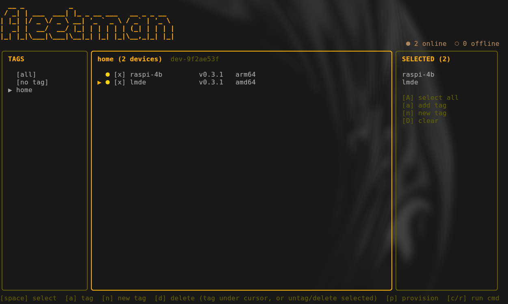

<div align="center">

# Fleetman

**Command a fleet of Linux devices from a single terminal.**

One master controls many agents. All traffic flows through a central server.

[](https://github.com/canavan-a/fleetman/releases/latest)
[](https://github.com/canavan-a/fleetman/actions/workflows/ci.yml)
[](go.mod)
[](LICENSE)



</div>

## Why Fleetman

- **One command, thousands of devices.** Target by ID, tag, label, or `{"all": true}`.
- **Agents dial out.** No inbound ports on your fleet. Every agent connects out to the server over WebSocket, so it works behind NAT and firewalls with zero config.
- **Tiny footprint.** A single static Go binary per component. The agent runs happily on a Raspberry Pi.
- **Built-in OTA updates.** Ship new agent binaries to the whole fleet through the same command channel.
- **Real TUI, not just a CLI.** Browse devices, tag them, select a subset, and fire off commands interactively.

```
Master (CLI/TUI) ──HTTP──> Server <──WebSocket── Agent
                                   <──WebSocket── Agent
                                   <──WebSocket── Agent (...thousands)
```

- **Server (hub)**: HTTP control plane + WebSocket data plane. Holds the device registry, routes commands, correlates results. SQLite for persistence.
- **Agent**: small daemon on each device. Dials out to the server over WebSocket. Executes commands, reports back.
- **Master**: CLI/TUI. Talks to the server's HTTP API to provision devices, send commands, and view results.

## Quickstart

```sh
# 1. Install and start the server (as root)
curl -fsSL https://github.com/canavan-a/fleetman/releases/latest/download/install-server.sh | sudo sh

# 2. Mint a master key on the server
curl -s -X POST localhost:3333/admin/master-keys -d '{"name": "my-laptop"}'

# 3. Install the master CLI/TUI on your machine and log in
curl -fsSL https://github.com/canavan-a/fleetman/releases/latest/download/install-master.sh | sh
fleetman login   # paste your server URL + master key
```

Run `fleetman`, press `[p]` to provision a device, and it will generate the exact agent install command for you to run on that device. No need to install the agent manually.

---

## Table of Contents

- [Master](#master)
- [Agent](#agent)
- [Server](#server)
- [License](#license)

---

## Master

### Install

```sh
curl -fsSL https://github.com/canavan-a/fleetman/releases/latest/download/install-master.sh | sh
```

Installs to `/usr/local/bin` when run as root, `~/.local/bin` otherwise. Override with `INSTALL_DIR`:

```sh
curl -fsSL https://github.com/canavan-a/fleetman/releases/latest/download/install-master.sh | INSTALL_DIR=/usr/bin sh
```

Or with Nix:

```sh
nix run github:canavan-a/fleetman --impure
```

Or add to your flake:

```nix
inputs.fleetman.url = "github:canavan-a/fleetman";

outputs = { self, nixpkgs, fleetman, ... }: {
  nixosConfigurations.myhost = nixpkgs.lib.nixosSystem {
    system = "x86_64-linux";
    modules = [
      ({ pkgs, ... }: {
        environment.systemPackages = [
          fleetman.packages.${pkgs.system}.fleetman
        ];
      })
    ];
  };
};
```

Pin to a specific release:

```nix
inputs.fleetman.url = "github:canavan-a/fleetman/v1.2.3";
```

### Usage

```sh
fleetman          # opens TUI login if not configured, then main view
fleetman login    # re-authenticate (prompts for server URL + master key)
fleetman logout   # clear saved credentials
```

On first run, `fleetman` prompts for your server URL and master API key and saves them to `~/.fleetman/config.yaml`.

---

## Agent

### Install

You don't normally need to run this by hand. In the master TUI, press `[p]` to provision a device and it prints the exact install command, already filled in with a token and device ID:

```sh
curl -fsSL https://github.com/canavan-a/fleetman/releases/latest/download/agent-install.sh | \
  sudo sh -s -- --unattended --server wss://your-server:8080 --token <token> --device-id <dev-id>
```

Run that on the device. Useful for automation and image-baking too, since it's a single non-interactive command.

To uninstall:

```sh
curl -fsSL https://github.com/canavan-a/fleetman/releases/latest/download/agent-uninstall.sh | sudo sh
```

---

## Server

### Install

```sh
curl -fsSL https://github.com/canavan-a/fleetman/releases/latest/download/install-server.sh | sudo sh
```

Requires root. Prompts for public port and admin port (defaults `:8080` and `127.0.0.1:3333`), then installs the binary, writes a systemd unit, and starts the service. The SQLite database is created automatically at `/var/lib/fleetman/fleetman.db`.

For unattended installs pass flags directly:

```sh
curl -fsSL https://github.com/canavan-a/fleetman/releases/latest/download/install-server.sh | \
  sudo sh -s -- --addr :9090 --admin-addr 127.0.0.1:4444
```

Or with Nix:

```sh
nix run github:canavan-a/fleetman#fleetman-server -- --addr :8080 --db fleetman.db
```

Or as a NixOS module:

```nix
inputs.fleetman.url = "github:canavan-a/fleetman";

outputs = { self, nixpkgs, fleetman, ... }: {
  nixosConfigurations.myhost = nixpkgs.lib.nixosSystem {
    system = "x86_64-linux";
    specialArgs = { inherit fleetman; };
    modules = [
      fleetman.nixosModules.fleetman-server
      ({ ... }: {
        services.fleetman-server.enable = true;
        # services.fleetman-server.addr      = ":8080";           # default
        # services.fleetman-server.adminAddr = "127.0.0.1:3333";  # default
        # services.fleetman-server.dbPath    = "/var/lib/fleetman/fleetman.db"; # default
      })
    ];
  };
};
```

### First-time setup

The server has no master keys on first boot. SSH in and create one via the local admin port:

```sh
curl -s -X POST localhost:3333/admin/master-keys -d '{"name": "my-laptop"}'
# → {"id": "...", "name": "my-laptop", "key": "abc123...", "created_at": "..."}
```

Save the returned key. It is shown only once. Use it as your master API key in `fleetman`.

### Managing master keys

The admin API listens on `127.0.0.1:3333` (localhost only, no auth). SSH into the server to use it.

```sh
# List keys (key value never shown again after creation)
curl -s localhost:3333/admin/master-keys

# Create a key
curl -s -X POST localhost:3333/admin/master-keys -d '{"name": "ci-deploy"}'

# Revoke a key
curl -s -X DELETE localhost:3333/admin/master-keys/{id}
```

### API

All endpoints except `/healthz` and `/ws` require `Authorization: Bearer <master-key>`.

| Method | Endpoint | Description |
|--------|----------|-------------|
| `GET` | `/healthz` | Health check |
| `GET` | `/ws` | WebSocket endpoint (agent auth via Bearer token) |
| `POST` | `/tokens` | Mint a device token → `{device_id, token}` |
| `GET` | `/devices` | List all devices with status, metadata, tags |
| `GET` | `/devices/{id}` | Get a single device |
| `DELETE` | `/devices/{id}` | Delete a device and revoke its token |
| `POST` | `/devices/{id}/tags` | Add tags to a device |
| `DELETE` | `/devices/{id}/tags/{tag}` | Remove a tag from a device |
| `POST` | `/commands` | Send a command to targeted devices |
| `GET` | `/commands/{id}` | Get command results (with device info joined) |
| `GET` | `/releases/{arch}` | Get current release URL for OTA |
| `GET` | `/tags` | List all tags |
| `POST` | `/tags` | Create a tag |
| `DELETE` | `/tags/{name}` | Delete a tag |
| `GET` | `/tags/{name}/devices` | List device IDs that have a tag |
| `POST` | `/tags/{name}/devices` | Bulk-add tag to devices |
| `DELETE` | `/tags/{name}/devices` | Bulk-remove tag from devices |

### Command Targeting

```json
{"all": true}
{"ids": ["dev-abc", "dev-def"]}
{"tags": ["production", "web"]}
{"labels": {"role": "webserver"}}
{"init_type": "systemd"}
```

Tags targeting requires the device to have **all** listed tags.

---

## License

See [LICENSE](LICENSE).
